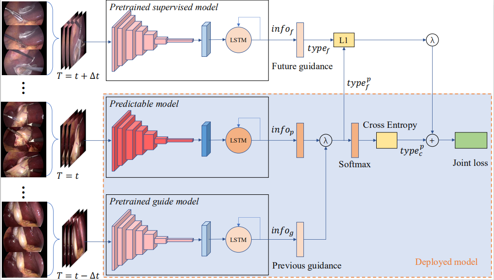

# Guided video recognition model
This is repo for paper:

**Guided activity prediction for minimally invasive surgery safety improvement in the internet of medical things**

Which solve the surgical workflow prediction with the guided network in IoMT system.


## Requirements

```shell script
pytorch >= 1.2.0
ffmpeg
cuda >= 10.0
tqdm
```

## Obtains data

You can download data from Cholec80 website. 


## Pre-processing data

### Video to image

you should install ffmpeg first.

```shell script
python datasets/video_to_img_cholec.py data/Videos/Full data/Frames/Full
```

You will find the img frame in the `Frames/Full`

### Flow extract

```shell script
python datasets/flow_extract_cholec.py data/Annotation/Phase
```

You will find the pkl file in the dst folder

### Label to json file

```shell script
python datasets/label_to_json_cholec.py data/Annotation/Phase/data.pkl data/Annotation/phase.txt data
```

It will cover the label to json file with named `data`. The format of the `data` is:
(It should be noticed that the 8 for stage before start, 7 for stage after end)

```json
{
   "labels": [
     "Start",
     "Preparation",
     "Calot_triangle_dissection",
     "Clipping_and_cutting",
     "Galbladder_dissection",
     "Galbladder_packaging",
     "Cleaning_and_coagulation",
     "Galbladder_retraction",
     "End"
   ],
   "database":[
      {
         "video": "hei-chole1",
         "step": "0-1-3",
         "segment": [
             4013,
             25361
         ],
         "n_frames": 21349,
         "last": "Preparation",
         "current": "Calot_triangle_dissection",
         "next": "Galbladder_dissection",
         "frame_indices": [<frames>],
         "train":[<finetune train frames>],
         "val":[<finetune val frames>],
         "test":[<finetune test frames>],
         "subset": "train"
      }
   ]
}
```

### Move the image to specific folder.

```shell script
python datasets/split_frames_with_class_cholec.py data/Frames/Full data/Annotation/Phase/data.pkl
```

It will move the frames to the corresponding folder by the `data.pkl`

## Fine-tune

### Fine-tune
You should change the value in the main.py then run
```python
is_finetune = True
is_pretrain_guide = False
is_guide = False
```
```shell script
python main.py
```

## Guided model training

### Train the model
You should change the value in the main.py then run
```python
is_finetune = False
is_pretrain_guide = True
is_guide = False
```
```shell script
python main.py
```

## Guide model training

### Train the model
You should change the value in the main.py then run
```python
is_finetune = False
is_pretrain_guide = False
is_guide = True
```
```shell script
python main.py
```


## Related code

- [https://github.com/kenshohara/3D-ResNets-PyTorch](https://github.com/kenshohara/3D-ResNets-PyTorch).
- [https://github.com/YuemingJin/SV-RCNet](https://github.com/YuemingJin/SV-RCNet)